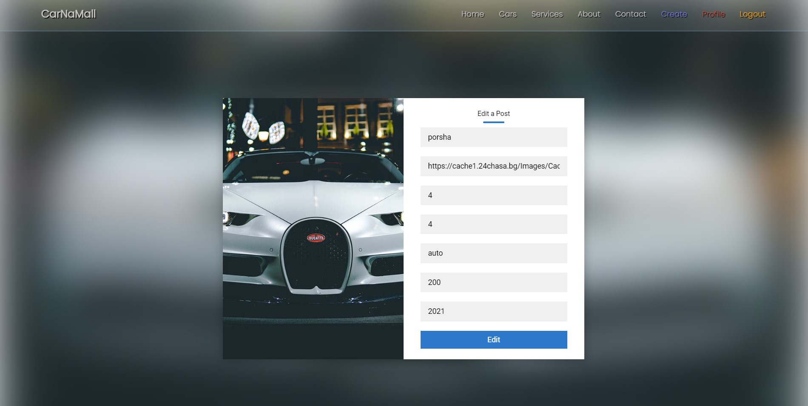

# JSAngular-CarnaMall-Workshop-2023
Workshop/Project Build for My JavaScript Angular Course in SoftUni!
### Website for Leasing and Renting Cars

## Description

This is a website for renting cars. 
It is a project for the "Angular - Front- End" course at Software University.
The whole project is using TypeScript.
The back end is written in Node.js and the database is MongoDB.
The front end is written in Angular.

## Local Installation

1. Clone the repository
2. Run `npm install` in both the `Client` and `Server` folders
3. Run `npm run dev` in the `Server` folder for a dev server. Navigate to `http://localhost:5050/`.
   Must fill .env.example (Rename it to .env) file before starting the Server. I am using MongoDB Atlas for the project.
5. Run `ng serve` in a dev server's `Client` folder. Navigate to `http://localhost:4200/`.

\
&nbsp;

## Built With
[](https://skillicons.dev)

\
&nbsp;

# Angular Sample Code　

```javascript
<header class="header">
    <a routerLink="/home" class="logo">CarNaMall</a>
    <nav class="navbar">
        <a routerLink="/home">Home</a>
        <a routerLink="/cars">Cars</a>
        <a routerLink="/services">Services</a>
        <a routerLink="/about">About</a>
        <a routerLink="/contact">Contact</a>
        <div class="userA" *ngIf="!isLogged">
            <a routerLink="/register">Register</a>
            <a routerLink="/login">Login</a>
        </div>
        <div class="userB" *ngIf="isLogged">
            <a routerLink="/create">Create</a>
            <a routerLink="/profile">Profile</a>
            <a (click)="logOut()">Logout</a>
        </div>
    </nav>
</header>
```

\
&nbsp;

# Screenshots

### Home page 


\
&nbsp;
### Cars list


\
&nbsp;
### Details page


\
&nbsp;
### Profile


\
&nbsp;
### Create user


\
&nbsp;
### Create-Edit Rents


\
&nbsp;
### Delete Form


\
&nbsp;
